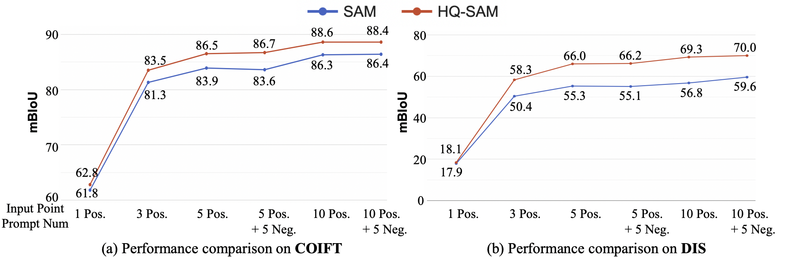

# Segment Anything in High Quality

> [**Segment Anything in High Quality**](https://arxiv.org/abs/2306.01567)           
> Lei Ke, Mingqiao Ye, Martin Danelljan, Yifan Liu, Yu-Wing Tai, Chi-Keung Tang, Fisher Yu \
> ETH Zurich & HKUST 

We propose HQ-SAM to upgrade SAM for high-quality zero-shot segmentation. Refer to our [paper](https://arxiv.org/abs/2306.01567) for more details.

Updates
-----------------
:fire::fire: We released the [colab notebook demo](https://colab.research.google.com/drive/1QwAbn5hsdqKOD5niuBzuqQX4eLCbNKFL?usp=sharing) and [automatic mask generator notebook](https://colab.research.google.com/drive/1dhRq4eR6Fbl-yl1vbQvU9hqyyeOidQaU?usp=sharing).

:fire::fire: We released the [model checkpoints](#model-checkpoints) and [demo visualization codes](#getting-started).

Visual comparison between SAM and HQ-SAM
-----------------
**SAM vs. HQ-SAM**
<table>
  <tr>
    <td></td>
    <td></td>
    <td></td>
  </tr>
  <tr>
    <td></td>
    <td></td>
    <td></td>
  </tr>
</table>


Introduction
-----------------
The recent Segment Anything Model (SAM) represents a big leap in scaling up segmentation models, allowing for powerful zero-shot capabilities and flexible prompting. Despite being trained with 1.1 billion masks, SAM's mask prediction quality falls short in many cases, particularly when dealing with objects that have intricate structures. We propose HQ-SAM, equipping SAM with the ability to accurately segment any object, while maintaining SAM's original promptable design, efficiency, and zero-shot generalizability. Our careful design reuses and preserves the pre-trained model weights of SAM, while only introducing minimal additional parameters and computation. We design a learnable High-Quality Output Token, which is injected into SAM's mask decoder and is responsible for predicting the high-quality mask. Instead of only applying it on mask-decoder features, we first fuse them with early and final ViT features for improved mask details. To train our introduced learnable parameters, we compose a dataset of 44K fine-grained masks from several sources. HQ-SAM is only trained on the introduced detaset of 44k masks, which takes only 4 hours on 8 GPUs. We show the efficacy of HQ-SAM in a suite of 9 diverse segmentation datasets across different downstream tasks, where 7 out of them are evaluated in a zero-shot transfer protocol. 


Quantitative comparison between SAM and HQ-SAM
-----------------
Note: For box-prompting-based evaluation, we feed SAM and our HQ-SAM with the same image/video bounding boxes and adopt the single mask output mode of SAM. 

### Various ViT backbones on COCO:

Note: For the COCO dataset, we use a SOTA detector FocalNet-DINO trained on the COCO dataset as our box prompt generator.

### YTVIS and HQ-YTVIS
Note:Using ViT-L backbone. We adopt the SOTA detector Mask2Former trained on the YouTubeVIS 2019 dataset as our video boxes prompt generator while reusing its object association prediction.


### DAVIS
Note: Using ViT-L backbone. We adopt the SOTA model XMem as our video boxes prompt generator while reusing its object association prediction.


 ### Interactive segmentation comparison using various points
Note:Using ViT-L backbone. On the high-quality COIFT (zero-shot) and DIS val set. 


### **Installation**
The code requires `python>=3.8`, as well as `pytorch>=1.7` and `torchvision>=0.8`. Please follow the instructions [here](https://pytorch.org/get-started/locally/) to install both PyTorch and TorchVision dependencies. Installing both PyTorch and TorchVision with CUDA support is strongly recommended.

Clone the repository locally and install with

```
git clone https://github.com/SysCV/sam-hq.git
cd sam-hq; pip install -e .
```

The following optional dependencies are necessary for mask post-processing, saving masks in COCO format, the example notebooks, and exporting the model in ONNX format. `jupyter` is also required to run the example notebooks.

```
pip install opencv-python pycocotools matplotlib onnxruntime onnx
```

### Example conda environment setup
```bash
conda create --name sam_hq python=3.8 -y
conda activate sam_hq
conda install pytorch==1.10.0 torchvision==0.11.0 cudatoolkit=11.1 -c pytorch -c nvidia
pip install opencv-python pycocotools matplotlib onnxruntime onnx

# under your working directory
git clone https://github.com/SysCV/sam-hq.git
cd sam-hq
pip install -e .
export PYTHONPATH=$(pwd)
```

### **Model Checkpoints**

Three HQ-SAM model versions of the model are available with different backbone sizes. These models can be instantiated by running

```
from segment_anything import sam_model_registry
sam = sam_model_registry["<model_type>"](checkpoint="<path/to/checkpoint>")
```

Download the provided trained model below and put them into the pretrained_checkpoint folder:
```
mkdir pretrained_checkpoint
``` 

Click the links below to download the checkpoint for the corresponding model type. We also provide **alternative model downloading links** [here](https://github.com/SysCV/sam-hq/issues/5) or at [hugging face](https://huggingface.co/lkeab/hq-sam/tree/main).
- `vit_b`: [ViT-B HQ-SAM model.](https://drive.google.com/file/d/11yExZLOve38kRZPfRx_MRxfIAKmfMY47/view?usp=sharing)
- `vit_l`: [ViT-L HQ-SAM model.](https://drive.google.com/file/d/1Uk17tDKX1YAKas5knI4y9ZJCo0lRVL0G/view?usp=sharing)
- `vit_h`: [ViT-H HQ-SAM model.](https://drive.google.com/file/d/1qobFYrI4eyIANfBSmYcGuWRaSIXfMOQ8/view?usp=sharing)

### **Getting Started**

First download a [model checkpoint](#model-checkpoints). Then the model can be used in just a few lines to get masks from a given prompt:

```
from segment_anything import SamPredictor, sam_model_registry
sam = sam_model_registry["<model_type>"](checkpoint="<path/to/checkpoint>")
predictor = SamPredictor(sam)
predictor.set_image(<your_image>)
masks, _, _ = predictor.predict(<input_prompts>)
```

Additionally, see the usage examples in our [demo](/demo/demo_hqsam.py) , [colab notebook](https://colab.research.google.com/drive/1QwAbn5hsdqKOD5niuBzuqQX4eLCbNKFL?usp=sharing) and [automatic mask generator notebook](https://colab.research.google.com/drive/1dhRq4eR6Fbl-yl1vbQvU9hqyyeOidQaU?usp=sharing).

To obtain HQ-SAM's visual result:
```
python demo/demo_hqsam.py
```

To obtain baseline SAM's visual result. Note that you need to download original SAM checkpoint from [baseline-SAM-L model](https://dl.fbaipublicfiles.com/segment_anything/sam_vit_l_0b3195.pth) and put it into the pretrained_checkpoint folder.
```
python demo/demo_sam.py
```


Citation
---------------
If you find HQ-SAM useful in your research or refer to the provided baseline results, please star :star: this repository and consider citing :pencil::
```
@article{sam_hq,
    title={Segment Anything in High Quality},
    author={Ke, Lei and Ye, Mingqiao and Danelljan, Martin and Liu, Yifan and Tai, Yu-Wing and Tang, Chi-Keung and Yu, Fisher},
    journal = {arXiv:2306.01567},
    year = {2023}
}  
```

## Acknowledgments
- Thanks [SAM](https://github.com/facebookresearch/segment-anything) for their public code and released models.
