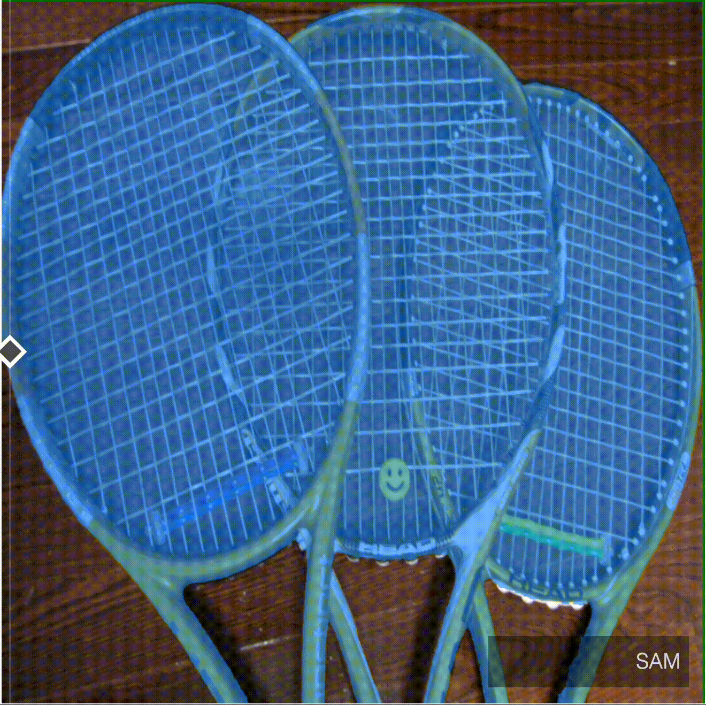
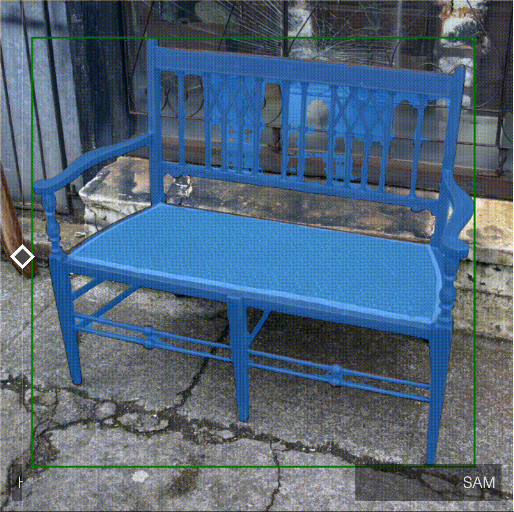
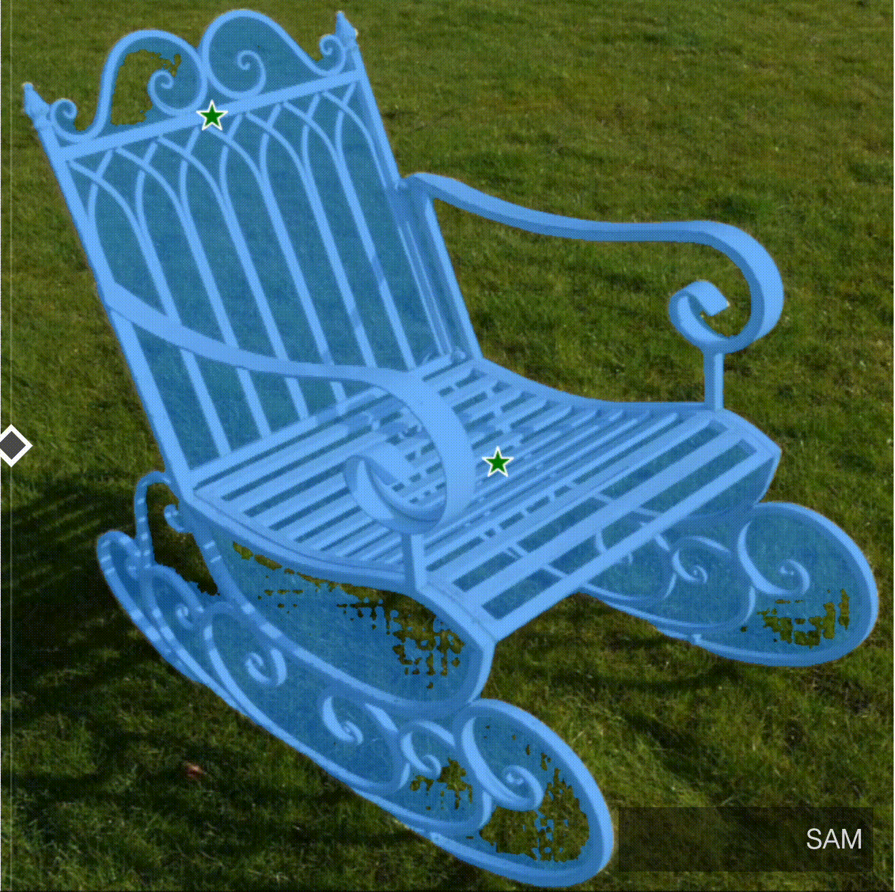
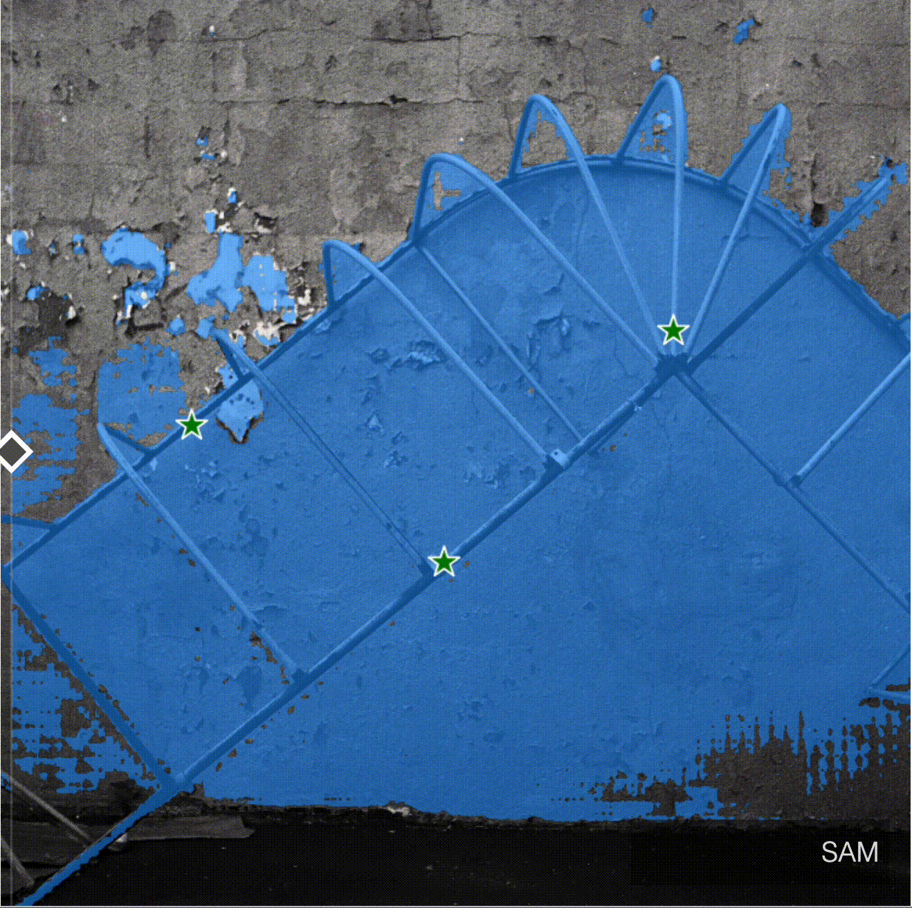
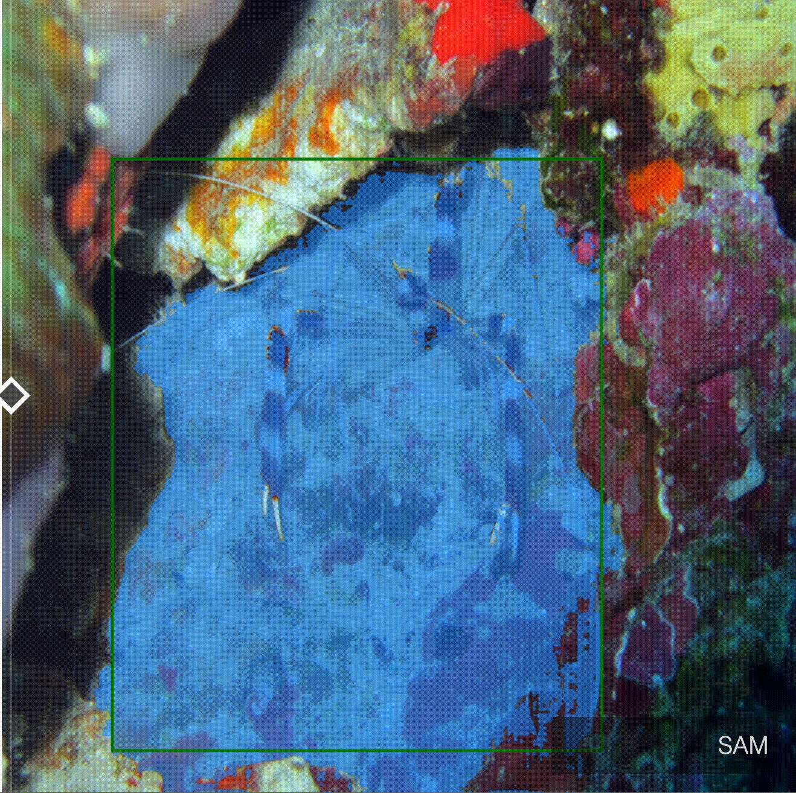
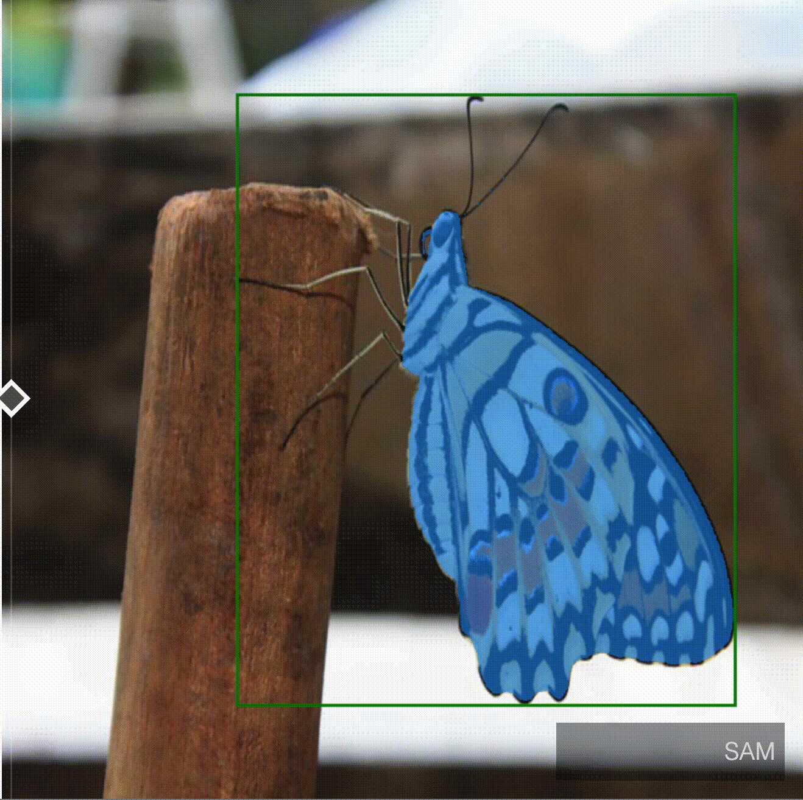
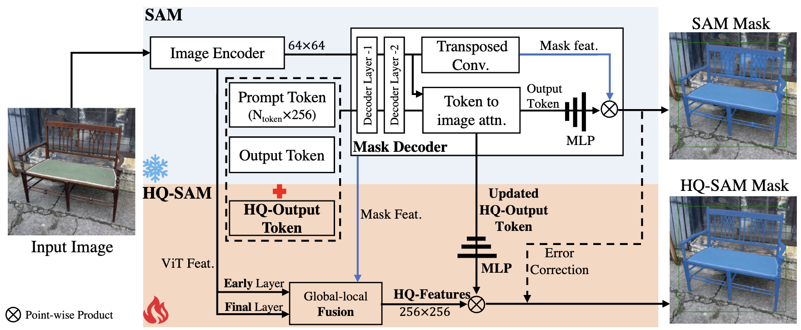
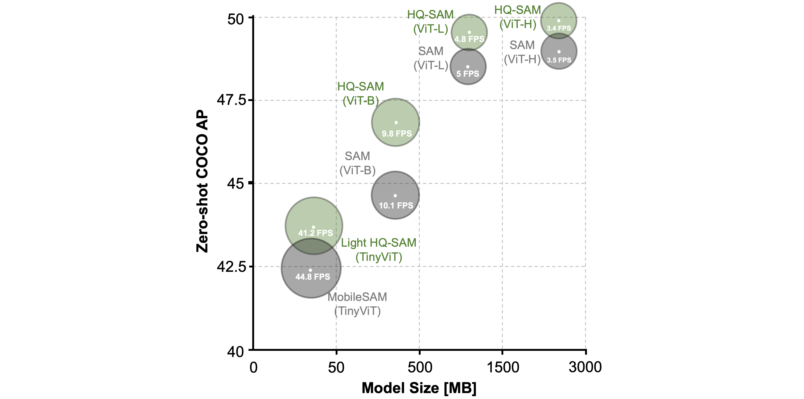
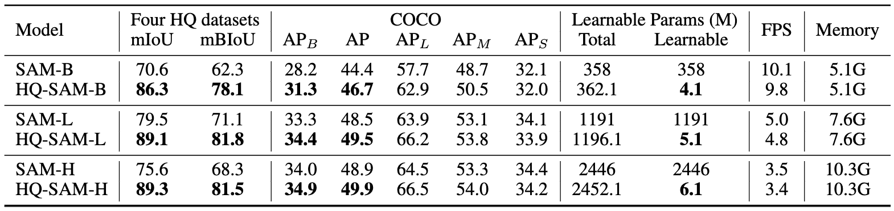
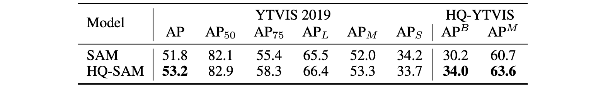

# Segment Anything in High Quality

[](https://paperswithcode.com/sota/zero-shot-segmentation-on-segmentation-in-the?p=segment-anything-in-high-quality)
<a href="https://colab.research.google.com/drive/1QwAbn5hsdqKOD5niuBzuqQX4eLCbNKFL?usp=sharing"></a>
[](https://huggingface.co/spaces/sam-hq-team/sam-hq)
[](https://openxlab.org.cn/apps/detail/keleiwhu/sam-hq)
[](https://pepy.tech/project/segment-anything-hq)


> [**Segment Anything in High Quality**](https://arxiv.org/abs/2306.01567)           
> NeurIPS 2023  
> ETH Zurich & HKUST 

We propose HQ-SAM to upgrade SAM for high-quality zero-shot segmentation. Refer to our [paper](https://arxiv.org/abs/2306.01567) for more details.

## Latest updates

**2024/11/17 -- HQ-SAM 2 is released**

- A new suite of improved model checkpoints (denoted as **HQ-SAM 2**, beta-version) are released. See [Model Description](sam-hq2/README.md) for details. Change working directory by `cd sam-hq2`


Updates
-----------------
:fire::fire: **SAM for Video Segmentation**: Interested in intersecting SAM and video? HQ-SAM is supported by [DEVA](https://github.com/hkchengrex/Tracking-Anything-with-DEVA) in its text-prompted mode! Also, check the work [MASA](https://github.com/siyuanliii/masa) and [SAM-PT](https://github.com/SysCV/sam-pt) with SAM.

:fire::fire: **SAM in 3D**: Interested in intersecting SAM and 3D Gaussian Splatting? See our new work [Gaussian Grouping](https://github.com/lkeab/gaussian-grouping)! Also, if you are interested in intersecting SAM and NeRF, please see work [SANeRF-HQ](https://github.com/lyclyc52/SANeRF-HQ)!

More: HQ-SAM is adopted in [Osprey](https://arxiv.org/abs/2312.10032), [CaR](https://torrvision.com/clip_as_rnn/), [SpatialRGPT](https://arxiv.org/abs/2406.01584), [GLaMM](https://arxiv.org/abs/2311.03356), [ENIGMA-51](https://iplab.dmi.unict.it/ENIGMA-51/) to provide fine-grained mask annotations.


Platform integration: HQ-SAM is supported in the [OpenMMLab PlayGround](https://github.com/open-mmlab/playground/blob/main/label_anything/readme.md) for annotation with Label-Studio, in [segment-geospatial](https://github.com/opengeos/segment-geospatial) for segmenting geospatial data, and mask annotation tool [ISAT](https://github.com/yatengLG/ISAT_with_segment_anything), and [Supervisely](https://supervisely.com/blog/segment-anything-in-high-quality-HQ-SAM/)!

2023/08/11: Support [python package](#quick-installation-via-pip) for easier **pip installation**. Light HQ-SAM is in [EfficientSAM series](https://github.com/IDEA-Research/Grounded-Segment-Anything/tree/main/EfficientSAM) combining with [Grounded SAM](https://github.com/IDEA-Research/Grounded-Segment-Anything/)!

<!-- 2023/07/21: HQ-SAM is also in OpenXLab apps, thanks their support! -->

:rocket::rocket: 2023/07/17: We released **Light HQ-SAM** using TinyViT as backbone, for both fast and high-quality zero-shot segmentation, which reaches **41.2 FPS**. Refer to [Light HQ-SAM vs. MobileSAM](#light-hq-sam-vs-mobilesam-on-coco) for more details.

:trophy::1st_place_medal: 2023/07/14: Grounded **HQ-SAM** obtains the **first place**:1st_place_medal: in the [Segmentation in the Wild](https://eval.ai/web/challenges/challenge-page/1931/leaderboard/4567) competition on zero-shot track (hosted in [CVPR 2023 workshop](https://computer-vision-in-the-wild.github.io/cvpr-2023/)), outperforming Grounded SAM. Refer to our [SGinW evaluation](#grounded-hq-sam-vs-grounded-sam-on-seginw) for more details.

2023/07/05: We released [SAM tuning instuctions](#hq-sam-tuning-and-hq-seg44k-data) and [HQSeg-44K data](#hq-sam-tuning-and-hq-seg44k-data).

2023/07/04: HQ-SAM is adopted in [SAM-PT](https://github.com/SysCV/sam-pt) to improve the SAM-based zero-shot video segmentation performance. Also, HQ-SAM is used in [Grounded-SAM](https://github.com/IDEA-Research/Grounded-Segment-Anything), [Inpaint Anything](https://github.com/Uminosachi/sd-webui-inpaint-anything) and [HQTrack](https://github.com/jiawen-zhu/HQTrack) (2nd in VOTS 2023).

2023/06/28: We released the [ONNX export script](#onnx-export) and [colab notebook](https://colab.research.google.com/drive/11U2La49c2IxahzJkAV-EzPqEH3cz_5hq?usp=sharing) for exporting and using ONNX model.

2023/06/23: Play with HQ-SAM demo at [](https://huggingface.co/spaces/sam-hq-team/sam-hq), which supports point, box and text prompts.

2023/06/14: We released the [colab demo](https://colab.research.google.com/drive/1QwAbn5hsdqKOD5niuBzuqQX4eLCbNKFL?usp=sharing) <a href="https://colab.research.google.com/drive/1QwAbn5hsdqKOD5niuBzuqQX4eLCbNKFL?usp=sharing"></a> and [automatic mask generator notebook](https://colab.research.google.com/drive/1dhRq4eR6Fbl-yl1vbQvU9hqyyeOidQaU?usp=sharing).

2023/06/13: We released the [model checkpoints](#model-checkpoints) and [demo visualization codes](#getting-started).

Visual comparison between SAM and HQ-SAM
-----------------
**SAM vs. HQ-SAM**
<table>
  <tr>
    <td></td>
    <td></td>
    <td></td>
  </tr>
  <tr>
    <td></td>
    <td></td>
    <td></td>
  </tr>
</table>


Introduction
-----------------
The recent Segment Anything Model (SAM) represents a big leap in scaling up segmentation models, allowing for powerful zero-shot capabilities and flexible prompting. Despite being trained with 1.1 billion masks, SAM's mask prediction quality falls short in many cases, particularly when dealing with objects that have intricate structures. We propose HQ-SAM, equipping SAM with the ability to accurately segment any object, while maintaining SAM's original promptable design, efficiency, and zero-shot generalizability. Our careful design reuses and preserves the pre-trained model weights of SAM, while only introducing minimal additional parameters and computation. We design a learnable High-Quality Output Token, which is injected into SAM's mask decoder and is responsible for predicting the high-quality mask. Instead of only applying it on mask-decoder features, we first fuse them with early and final ViT features for improved mask details. To train our introduced learnable parameters, we compose a dataset of 44K fine-grained masks from several sources. HQ-SAM is only trained on the introduced detaset of 44k masks, which takes only 4 hours on 8 GPUs. We show the efficacy of HQ-SAM in a suite of 9 diverse segmentation datasets across different downstream tasks, where 7 out of them are evaluated in a zero-shot transfer protocol. 



Quantitative comparison between SAM and HQ-SAM
-----------------
Note: For box-prompting-based evaluation, we feed SAM, MobileSAM and our HQ-SAM with the same image/video bounding boxes and adopt the single mask output mode of SAM. 

We provide comprehensive performance, model size and speed comparison on SAM variants:


### Various ViT backbones on COCO:

Note: For the COCO dataset, we use a SOTA detector FocalNet-DINO trained on the COCO dataset as our box prompt generator.

### YTVIS and HQ-YTVIS
Note:Using ViT-L backbone. We adopt the SOTA detector Mask2Former trained on the YouTubeVIS 2019 dataset as our video boxes prompt generator while reusing its object association prediction.


### DAVIS
Note: Using ViT-L backbone. We adopt the SOTA model XMem as our video boxes prompt generator while reusing its object association prediction.


### **Quick Installation via pip**
```
pip install segment-anything-hq
python
from segment_anything_hq import sam_model_registry
model_type = "<model_type>" #"vit_l/vit_b/vit_h/vit_tiny"
sam_checkpoint = "<path/to/checkpoint>"
sam = sam_model_registry[model_type](checkpoint=sam_checkpoint)
```

see specific usage example (such as vit-l) by running belowing command:
```
export PYTHONPATH=$(pwd)
python demo/demo_hqsam_pip_example.py
```


### **Standard Installation**
The code requires `python>=3.8`, as well as `pytorch>=1.7` and `torchvision>=0.8`. Please follow the instructions [here](https://pytorch.org/get-started/locally/) to install both PyTorch and TorchVision dependencies. Installing both PyTorch and TorchVision with CUDA support is strongly recommended.

Clone the repository locally and install with

```
git clone https://github.com/SysCV/sam-hq.git
cd sam-hq; pip install -e .
```

The following optional dependencies are necessary for mask post-processing, saving masks in COCO format, the example notebooks, and exporting the model in ONNX format. `jupyter` is also required to run the example notebooks.

```
pip install opencv-python pycocotools matplotlib onnxruntime onnx timm
```

### Example conda environment setup
```bash
conda create --name sam_hq python=3.8 -y
conda activate sam_hq
conda install pytorch==1.10.0 torchvision==0.11.0 cudatoolkit=11.1 -c pytorch -c nvidia
pip install opencv-python pycocotools matplotlib onnxruntime onnx timm

# under your working directory
git clone https://github.com/SysCV/sam-hq.git
cd sam-hq
pip install -e .
export PYTHONPATH=$(pwd)
```

### **Model Checkpoints**

Three HQ-SAM model versions of the model are available with different backbone sizes. These models can be instantiated by running

```
from segment_anything import sam_model_registry
sam = sam_model_registry["<model_type>"](checkpoint="<path/to/checkpoint>")
```

Download the provided trained model below and put them into the pretrained_checkpoint folder:
```
mkdir pretrained_checkpoint
``` 

Click the links below to download the checkpoint for the corresponding model type. We also provide **alternative model downloading links** [here](https://github.com/SysCV/sam-hq/issues/5) or at [hugging face](https://huggingface.co/lkeab/hq-sam/tree/main).
- `vit_b`: [ViT-B HQ-SAM model.](https://drive.google.com/file/d/11yExZLOve38kRZPfRx_MRxfIAKmfMY47/view?usp=sharing)
- `vit_l`: [ViT-L HQ-SAM model.](https://drive.google.com/file/d/1Uk17tDKX1YAKas5knI4y9ZJCo0lRVL0G/view?usp=sharing)
- `vit_h`: [ViT-H HQ-SAM model.](https://drive.google.com/file/d/1qobFYrI4eyIANfBSmYcGuWRaSIXfMOQ8/view?usp=sharing)
- `vit_tiny` (**Light HQ-SAM** for real-time need): [ViT-Tiny HQ-SAM model.](https://huggingface.co/lkeab/hq-sam/resolve/main/sam_hq_vit_tiny.pth)

### **Getting Started**

First download a [model checkpoint](#model-checkpoints). Then the model can be used in just a few lines to get masks from a given prompt:

```
from segment_anything import SamPredictor, sam_model_registry
sam = sam_model_registry["<model_type>"](checkpoint="<path/to/checkpoint>")
predictor = SamPredictor(sam)
predictor.set_image(<your_image>)
masks, _, _ = predictor.predict(<input_prompts>)
```

Additionally, see the usage examples in our [demo](/demo/demo_hqsam.py) , [colab notebook](https://colab.research.google.com/drive/1QwAbn5hsdqKOD5niuBzuqQX4eLCbNKFL?usp=sharing) and [automatic mask generator notebook](https://colab.research.google.com/drive/1dhRq4eR6Fbl-yl1vbQvU9hqyyeOidQaU?usp=sharing).

To obtain HQ-SAM's visual result:
```
python demo/demo_hqsam.py
```

To obtain baseline SAM's visual result. Note that you need to download original SAM checkpoint from [baseline-SAM-L model](https://dl.fbaipublicfiles.com/segment_anything/sam_vit_l_0b3195.pth) and put it into the pretrained_checkpoint folder.
```
python demo/demo_sam.py
```

To obtain Light HQ-SAM's visual result:
```
python demo/demo_hqsam_light.py
```

### **HQ-SAM Tuning and HQ-Seg44k Data**
We provide detailed training, evaluation, visualization and data downloading instructions in [HQ-SAM training](train/README.md). You can also replace our training data to obtain your own SAM in specific application domain (like medical, OCR and remote sensing).

Please change the current folder path to:
```
cd train
```
and then refer to detailed [readme instruction](train/README.md).

### **Grounded HQ-SAM vs Grounded SAM on [SegInW](https://eval.ai/web/challenges/challenge-page/1931/overview?ref=blog.roboflow.com)**

Grounded HQ-SAM wins the **first place**:1st_place_medal: on SegInW benchmark (consist of 25 public zero-shot in the wild segmentation datasets), and outpuerforming Grounded SAM using the same grounding-dino detector.

<table><tbody>
<!-- START TABLE -->
<!-- TABLE HEADER -->
<th valign="bottom">Model Name</th>
<th valign="bottom">Encoder</th>
<th valign="bottom">GroundingDINO</th>
<th valign="bottom">Mean AP</th>
<th valign="bottom">Evaluation Script</th>
<th valign="bottom">Log</th>
<th valign="bottom">Output Json</th>
<!-- TABLE BODY -->
<!-- ROW: maskformer2_R50_bs16_50ep -->
 <tr><td align="left">Grounded SAM</td>
<td align="center">vit-h</td>
<td align="center">swin-b</td>
<td align="center">48.7</td>
<td align="center"><a href="seginw/test_seginw.sh">script</a></td>
<td align="center"><a href="seginw/logs/grounded_sam.log">log</a></td>
<td align="center"><a href="https://huggingface.co/sam-hq-team/SegInW/resolve/main/result/grounded_sam.zip">result</a></td>
</tr>
<!-- ROW: maskformer2_R101_bs16_50ep -->
 <tr><td align="left">Grounded HQ-SAM</td>
<td align="center">vit-h</td>
<td align="center">swin-b</td>
<td align="center"><b>49.6</b></td>
<td align="center"><a href="seginw/test_seginw_hq.sh">script</a></td>
<td align="center"><a href="seginw/logs/grounded_hqsam.log">log</a></td>
<td align="center"><a href="https://huggingface.co/sam-hq-team/SegInW/resolve/main/result/grounded_hqsam.zip">result</a></td>
</tr>
</tbody></table>

Please change the current folder path to:
```
cd seginw
```
We provide detailed evaluation instructions and metrics on SegInW in [Grounded-HQ-SAM evaluation](seginw/README.md).

### **Light HQ-SAM vs MobileSAM on COCO**
We propose [Light HQ-SAM](#model-checkpoints) based on the tiny vit image encoder provided by MobileSAM. We provide quantitative comparison on zero-shot COCO performance, speed and memory below. Try Light HQ-SAM at [here](#getting-started).

<table><tbody>
<!-- START TABLE -->
<!-- TABLE HEADER -->
<th valign="bottom">Model</th>
<th valign="bottom">Encoder</th>
<th valign="bottom">AP</th>
<th valign="bottom">AP@L</th>
<th valign="bottom">AP@M</th>
<th valign="bottom">AP@S</th>
<th valign="bottom">Model Params (MB)</th>
<th valign="bottom">FPS</th>
<th valign="bottom">Memory (GB)</th>
<!-- TABLE BODY -->
<!-- ROW: maskformer2_R50_bs16_50ep -->
 <tr><td align="left">MobileSAM</td>
<td align="center">TinyViT</td>
<td align="center">44.3</td>
<td align="center">61.8</td>
<td align="center">48.1</td>
<td align="center">28.8</td>
<td align="center">38.6</td>
<td align="center">44.8</td>
<td align="center">3.7</td>
</tr>
<!-- ROW: maskformer2_R101_bs16_50ep -->
 <tr><td align="left"><b>Light HQ-SAM</b></td>
 <td align="center">TinyViT</td>
<td align="center"><b>45.0</b></td>
<td align="center">62.8</td>
<td align="center">48.8</td>
<td align="center">29.2</td>
<td align="center">40.3</td>
<td align="center">41.2</td>
<td align="center">3.7</td>
</tr>
</tbody></table>

Note: For the COCO dataset, we use the same SOTA detector FocalNet-DINO trained on the COCO dataset as our and Mobile sam's box prompt generator.


### **ONNX export**
HQ-SAM's lightweight mask decoder can be exported to ONNX format so that it can be run in any environment that supports ONNX runtime. Export the model with
```
python scripts/export_onnx_model.py --checkpoint <path/to/checkpoint> --model-type <model_type> --output <path/to/output>
```
See the [example notebook](https://colab.research.google.com/drive/11U2La49c2IxahzJkAV-EzPqEH3cz_5hq?usp=sharing) for details on how to combine image preprocessing via HQ-SAM's backbone with mask prediction using the ONNX model. It is recommended to use the latest stable version of PyTorch for ONNX export.


Citation
---------------
If you find HQ-SAM useful in your research or refer to the provided baseline results, please star :star: this repository and consider citing :pencil::
```
@inproceedings{sam_hq,
    title={Segment Anything in High Quality},
    author={Ke, Lei and Ye, Mingqiao and Danelljan, Martin and Liu, Yifan and Tai, Yu-Wing and Tang, Chi-Keung and Yu, Fisher},
    booktitle={NeurIPS},
    year={2023}
}  
```
Related high-quality instance segmentation work:
```
@inproceedings{transfiner,
    title={Mask Transfiner for High-Quality Instance Segmentation},
    author={Ke, Lei and Danelljan, Martin and Li, Xia and Tai, Yu-Wing and Tang, Chi-Keung and Yu, Fisher},
    booktitle={CVPR},
    year={2022}
}
```

## Acknowledgments
- Thanks [SAM](https://github.com/facebookresearch/segment-anything), [Grounded SAM](https://github.com/IDEA-Research/Grounded-Segment-Anything) and [MobileSAM](https://github.com/ChaoningZhang/MobileSAM) for their public code and released models.
